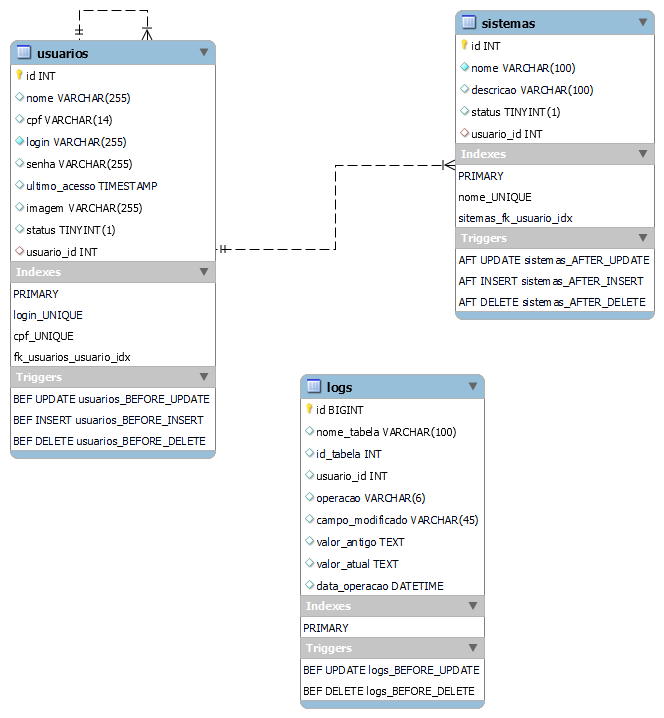

# <a href="#">ServicoNotificacao</a>
Serviço de Notificação é um serviço que simula o envio de notificação por e-mail ou sms consultando dados no banco de dados.

### Pré-requisitos

Antes de começar, você vai precisar ter instalado em sua máquina as seguintes ferramentas:
[Git](https://git-scm.com) e [JDK 11](https://www.oracle.com/br/java/technologies/javase-jdk11-downloads.html). 
Além disto é bom ter um editor para trabalhar com o código como [Spring Tools Suite](https://spring.io/tools).

## 🔧 Bibliotecas utilizadas

* **[spring-boot-starter-parent](https://mvnrepository.com/artifact/org.springframework.boot/spring-boot-starter-parent)**
* **[spring-boot-starter-data-jpa](https://mvnrepository.com/artifact/org.springframework.boot/spring-boot-starter-data-jpa)**
* **[mysql-connector-j](https://mvnrepository.com/artifact/com.mysql/mysql-connector-j)**
* **[lombok](https://mvnrepository.com/artifact/org.projectlombok/lombok)**
* **[spring-boot-devtools](https://mvnrepository.com/artifact/org.springframework.boot/spring-boot-devtools)**
* **[spring-boot-maven-plugin](https://mvnrepository.com/artifact/org.springframework.boot/spring-boot-maven-plugin)**

## 🛠️ Configurando o ambiente

```bash
# Abra o repositório clonado e aguarde o download das dependências.
$ 

```

## 🎲 Executando projeto

```bash

# Clone o projeto.
$ git clone https://github.com/srgeverson/ServicoNotificacao.git

# Abra a pasta clonada com o Spring Tool Suite
$ cd ServicoNotificacao/

```

## 📃 Backup/Restore de dados

```bash
# Em ambientes windows execute o seguinte comando
$ cd C:\Program Files\MySQL\MySQL Server 8.0\

# Autenticando no banco de dados em seguida será solicitado a senha
$ mysql -u root -p

# Saindo da autenticação
$ exit;

# Salvando dados
$ mysqldump -u root -p system > {PASTA_DE_DESTINO_DO_BACACKUP}/backup_db_system.sql

# Resraurando
$ mysql -u root -p system < {PASTA_ONDE_O_PROJETO_FOI_CLONADO}/system/sql/system.sql

```

## 📃 Documentos Referênciados

* **Diagrama de Entidade Relacionamento - MER**

<p align="center">
    
</p>

## 👨‍💻 Equipe de Desenvolvimento

* **Geverson Souza** - [Geverson Souza](https://www.linkedin.com/in/srgeverson/)
## ✒️ Autores

* **Geverson Souza** - [Geverson Souza](https://www.linkedin.com/in/srgeverson/)

## 📌 Versão 1.0.1

Nós usamos [Github](https://github.com/) para controle de versão.
